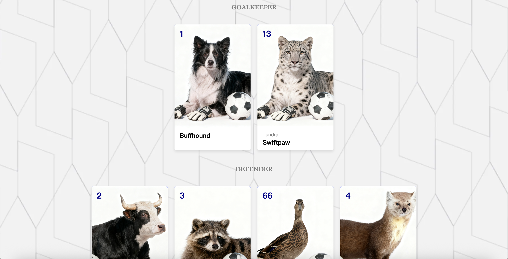

# FC Animalia
### *A Football Club Where Every Species Belongs*


**Creator:** [Zihan Jiang](https://zzzzzihann.github.io/CommLab2025Fall/)

**Description:** [FC Animalia](https://zzzzzihann.github.io/CommLab2025Fall/shanzhaiweb) is a fictional football club page that fuses sports aesthetics with storytelling. Beyond the fantasy of animals taking the field, it envisions a parade of **coexistence**—where differences in size, species, and color dissolve in the shared rhythm and joy of the game




**Abstract:** FC Animalia takes inspiration from real animals that once accidentally wandered onto football fields and were captured by cameras, reimagining a football culture through an interspecies lens. In this fictional club, cats, dogs, deer, raccoons, and many others play side by side, forming a team that transcends species boundaries. Through playful storytelling—from tongue-in-cheek player interviews to theatrical club announcements—the project gives voice to these animals, weaving their instincts and characteristics into the narrative itself. This interspecies collaboration mirrors the stereotypes and invisible boundaries shaped by gender, race, and skin color within real football communities. By combining the visual aesthetics of professional sports (drawing design references from the Premier League club Everton’s website) with narrative structure, FC Animalia presents a utopia from a shifted perspective, aiming to remind the world that belonging is not born of sameness, but of resonance.

## Design Process

### Design and Composition

My design process began at the start of the new Premier League season, when I frequently browsed the Everton FC website because my favorite player had joined the team. I found their website visually appealing and minimalistic, so I decided to use it as the main design reference for FC Animalia.

I directly borrowed the layout structure from Everton’s homepage and player pages, especially in terms of composition and placement. However, I reinterpreted the visual experience by replacing most of the textual titles with hover images to create a more interactive and immersive experience. While maintaining the overall page structure, I customized the content and visual hierarchy to better reflect the concept of FC Animalia.
Because Everton’s original color palette—mainly variations of blue and white—is already very harmonious, I kept those colors as my visual foundation. On the subpage featuring news articles, I reconfigured the relationship between text and images so that the length of the written content would align better with the image proportions, achieving a more balanced composition (since the original Everton site contains more photographs and longer text).

For the “Our History” page, I created a new layout that does not exist on the Everton site, using a full-width stadium photograph as the background to introduce the team. This decision reflects my main intention in designing the website—to build a sense of identity and atmosphere that feels both familiar and reimagined.
I also applied principles from Gestalt theory, particularly proximity and similarity, to guide how information is grouped and perceived. For instance, related content and buttons share consistent spacing and alignment, encouraging the viewer’s eye to recognize them as connected elements. Meanwhile, the hover effects create a subtle disruption in the Gestalt unity, prompting users to actively engage and “discover” meaning through motion.

Interactive gestures such as scrolling and linking play a key role in my reinterpretation. On both the homepage and subpages, users can scroll to reveal more news or click on banners to navigate between pages. Advertisements link directly to Amazon product pages, while images lead to related news articles. The main banner connects to the Amazon store, and the “Team” and “Players” pages are interconnected through buttons and hover interactions. These small, continuous actions transform the browsing process into a narrative experience, shifting the original tone of a traditional sports site into something more playful and conceptual.

### Technical

Technical
My HTML hierarchy follows a modular structure that organizes the site into clearly defined sections. On the index page, I used several main ``div`` classes:

* ``top-nav`` for the top navigation bar,
* ``header`` for the title banner,
* ``headline`` for the main featured news section,
* ``advertisement`` for sponsored content,
* ``teamnews`` for the latest news grid, and
* ``footer`` for the bottom navigation.

Within the headline section, the layout features one large headline on the left and three smaller sidebar stories on the right. To achieve this, I used an ID structure including ``statement`` (for the large main story) and ``sidebar1``, ``sidebar2``, and ``sidebar3`` for the smaller ones. I also implemented a hover effect on each sidebar image to reveal text titles interactively, enhancing user engagement.

In the advertisement section, a general class defines the layout area, while a smaller ID ad positions and resizes the images to match the overall composition.Similarly, in the teamnews section, I used IDs (``news1``, ``news2``, ``news3``, ``news4``) to differentiate layout and hover behaviors among different news cards.

Across all news pages, I maintained consistent elements such as the top-nav and header. However, the main content section—defined by the class mainphoto—varies according to image and text arrangement. I used specific IDs like ``text-left``, ``text-center``, and ``photo-center`` to define whether the text or image should be aligned to the left, center, or right. Below is one example of my CSS structure for these layouts:

```
.mainphoto {
    display: flex;
    justify-content: space-around;
    align-items: flex-start;
    gap: 40px;
    padding: 20px 40px;
    margin-bottom: 10px;
    position: relative;
}

#text-left {
    flex: 1;
    max-width: 530px;
}

#text-left p {
    font-size: 15px;
    font-family: Verdana, Geneva, Tahoma, sans-serif;
    line-height: 20px;
    margin-top: 25px;
    margin-right: 25px;
}

#text-left h1 {
    font-size: 15px;
    font-family: Georgia, 'Times New Roman', Times, serif;
    font-style: italic;
    color: darkblue;
    text-shadow: 1px 1px 2px white;
    line-height: 20px;
    margin-right: 25px;
    margin-top: 80px;
}
One of the most challenging technical parts appeared in the Player Introduction page (Team),
where I needed to center each player’s photo and give the cards a smooth, rounded appearance.
After extensive research, I developed the following CSS structure:
.player-card {
    width: 220px;
    background-color: white;
    box-shadow: 0 4px 8px rgba(0,0,0,0.1);
    border-radius: 5px;
    overflow: hidden;
}

.player-photo {
    background-color: #0026ff;
    position: relative;
    height: 300px;
    display: flex;
    justify-content: center;
    align-items: center;
}

.player-photo img {
    height: 100%;
    object-fit: cover;
}
```

Here,
* ``border-radius: 5px`` softens the card edges to create a more polished look,
* ``overflow: hidden`` ensures that image corners do not extend beyond the rounded card border, and
* ``object-fit: cover`` makes the image scale responsively to fill the photo container without distortion.
These three properties work together to maintain visual consistency and balance, and I learned about them through documentation on [MDN Web Docs (Mozilla Developer Network)](https://developer.mozilla.org/en-US/) when troubleshooting alignment and cropping issues.

### Reflection and Future Development

Overall, I am quite satisfied with how my project developed from its initial proposal to the final version. In particular, I truly enjoyed the storytelling aspect and the overall visual presentation of the website. Since my site includes multiple subpages, it allowed me to explore narrative depth within the structure of a sports team’s online identity.

However, one area I regret not being able to develop further is the representation of player diversity—specifically, how individual player stories could better convey this theme. As I mentioned during my presentation, my News Page could have benefited from adopting more professional typography similar to real football club websites. I initially avoided directly replicating Everton’s news layout because I found their design left too much unused space on both sides, but in retrospect, more refined type and spacing could have made my layout look more polished.

During user testing, I received several constructive pieces of feedback, including the suggestion to ``center-align`` with  ``max-width`` the news text to enhance readability and professionalism. Another useful comment was to include consistent header and footer navigation bars so users could easily return to the main page from anywhere on the site. Implementing these changes noticeably improved the user experience and strengthened the sense of cohesion across different sections.

Looking forward, I would like to expand the worldbuilding of this fictional football club and use storytelling more deliberately to critically reflect on issues of discrimination and bias within the contemporary football world. By doing so, I hope to push the conceptual dimension of the project further and turn the website into a more critical, narrative-driven media work rather than just a design exercise.

### Credits & References
First of all, I want to thank everyone in CommLab: Web (Fall 2025) for all the critiques and feedback.

Secondly, as I mentioned in the notes on the index page, this website is inspired by [Everton FC](www.evertonfc.com). As a fan of Jack Grealish, who has gone through two difficult years of watching and waiting for him to finally play, I want to thank the Evertonians who welcomed Jack as part of the family as soon as he wore the blue. I hope there are many more assists, goals, and victories to come.

Also, the original idea of animals on the pitch came from another team I deeply love — New York City FC. The player [Raquinho](https://www.youtube.com/watch?v=Xg6sA-Z_yo4) mentioned in the news is a real animal who once appeared on the pitch during a game where NYCFC played against Philadelphia. He brought us a winning game, and that moment became the beginning of a story that still echoes years later.

Thirdly, I’ve cited all the photos I used in the code’s notes — applause to all the creators, artists and photographers.

Last but not least, here are the references and resources I consulted while working on my code:

* MDN Web Docs (Mozilla Developer Network): [``border-radius``](https://developer.mozilla.org/en-US/docs/Web/CSS/border-radius), [``overflow``](https://developer.mozilla.org/en-US/docs/Web/CSS/overflow) and  [``object-fit``](https://developer.mozilla.org/en-US/docs/Web/CSS/object-fit).

* W3Schools: [``background-blend-mode``](https://www.w3schools.com/cssref/playdemo.php?filename=playcss_background-blend-mode&preval=lighten) and how to have text in transparent box by adjusting [opacity](https://www.w3schools.com/css/css_image_transparency.asp).

Thank you all :)